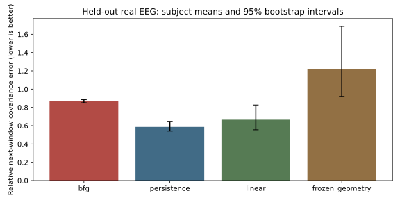

# Real EEG covariance prediction results

This experiment tests a specified additional EEG preparation and covariance readout attached to the finite BFG kernel. It does not test physical universality or phenomenal consciousness.

**Outcome: the predeclared practical success target was not met.**

The held-out evaluation includes 69 subjects and 3685 eligible two-second window pairs. The common nonterminal comparison contains 3685 pairs. 0 recordings were excluded; 28 windows failed the fixed quality criteria across development and holdout recordings.

| Model | Mean relative covariance error | 95% subject bootstrap interval | Coverage |
|---|---:|---:|---:|
| bfg | 0.867404 | [0.850767, 0.884306] | 100.00% |
| persistence | 0.586428 | [0.541101, 0.647656] | 100.00% |
| linear | 0.665498 | [0.555150, 0.826170] | 100.00% |
| frozen_geometry | 1.220581 | [0.920797, 1.686077] | 100.00% |

All table errors use the common nonterminal subset. Comparator errors on all eligible pairs are also recorded in summary.json. Subjects are weighted equally, with runs averaged within subjects.

| Comparator | BFG minus comparator error | 95% paired subject bootstrap interval |
|---|---:|---:|
| persistence | 0.280976 | [0.219269, 0.329899] |
| linear | 0.201905 | [0.042834, 0.313392] |
| frozen_geometry | -0.353178 | [-0.814991, -0.053932] |

Positive differences mean BFG is worse. Intervals are exploratory and unadjusted for multiple comparisons.

## Conditions

| Condition | BFG | Persistence | Linear | Frozen geometry |
|---|---:|---:|---:|---:|
| eyes_open | 0.857286 | 0.644783 | 0.692754 | 1.201777 |
| eyes_closed | 0.877522 | 0.528073 | 0.638242 | 1.239386 |

## Interpretation and limits

The EEG bridge resets a full state from each current measurement window. K, P and the witness identification are constitutive choices; the measurement-to-state identification and the two-second clock are not derived by the paper. This is one-step prediction with measurement assimilation, not an independently calibrated autonomous many-step physical orbit.

The canonical load damping and the absolute scale of measured covariance may be poorly matched by this preparation/readout. No amplitude correction was fitted after evaluation. Failure rejects this tested bridge/predictor and does not invalidate algebraic matrix identities. A feature classifier or an unconstrained fitted map would answer a different question.

These short baseline runs include eyes-open and eyes-closed recordings, not sleep, anesthesia, interventions or reports of subjective experience. The fixed eight-channel montage and basic artifact screening do not eliminate every EEG artifact. Subjects were separated by numeric ID rather than randomized; independent external replication remains needed.

The rank sensitivity audit changed 76 held-out pair outcomes between tolerances 1e-10 and 1e-14. Exact-rank mathematics remains distinct from floating-point thresholding.

## Reproduction

From this directory, install requirements.txt in a virtual environment, run `python -m unittest -v test_experiment`, then `python experiment.py download`, `python experiment.py evaluate`, and `python report.py`. Downloads use the original PhysioNet URLs with retries. Raw EDF data are not committed. `results/windows.csv.gz` stores all window sufficient statistics in squared volts; `pairs.csv.gz` stores each prediction loss and terminal status. Decompress these with gzip or read them with Python gzip.open. `subjects.csv`, `qc.csv`, `data_manifest.csv`, `development_parameters.json` and `summary.json` expose aggregation, exclusions and fitted values.

The frozen protocol was committed before measurement download as 37f31b1b8aae878418fe2510a55b7896bb114579. Paper source: commit 76d9e87b4275ec41b3dcd84434e2ee3791a8d076, dated 6 October 2026. The original PDF controls formula typography.

## Data attribution and rights

Schalk, G. (2009). EEG Motor Movement/Imagery Dataset, version 1.0.0. PhysioNet. https://doi.org/10.13026/C28G6P. Original acquisition publication: Schalk et al., BCI2000: A General-Purpose Brain-Computer Interface (BCI) System, IEEE Transactions on Biomedical Engineering 51(6), 1034–1043 (2004).

Third-party measurements and derived measurement tables retain Open Data Commons Attribution License 1.0 attribution: https://opendatacommons.org/licenses/by/1-0/. This does not change the repository rights notice for original code or documentation. Source: https://physionet.org/content/eegmmidb/1.0.0/.

PhysioNet platform citation: Pollard et al. (2026), PhysioNet as a global platform for biomedical research, Nature Health, https://doi.org/10.1038/s44360-026-00096-z.
