# 3D panels and numerical data

Panels follow the paper's dependency order. Computed families, conditional models and schematic status panels are distinguished. Colours encode displayed height only; they are not independent measured variables.

## Figure 1

Figure 1. Dimensionless order readout. Conditional readout. phi_E=(E_exp/E_bind)(I/I_0); ratios are independent inputs, not identified Xi data. Horizontal and vertical coordinate ranges are the sampled grids; the plotted quantity is identified on the height axis. Surface colour follows height and has no additional physical meaning.

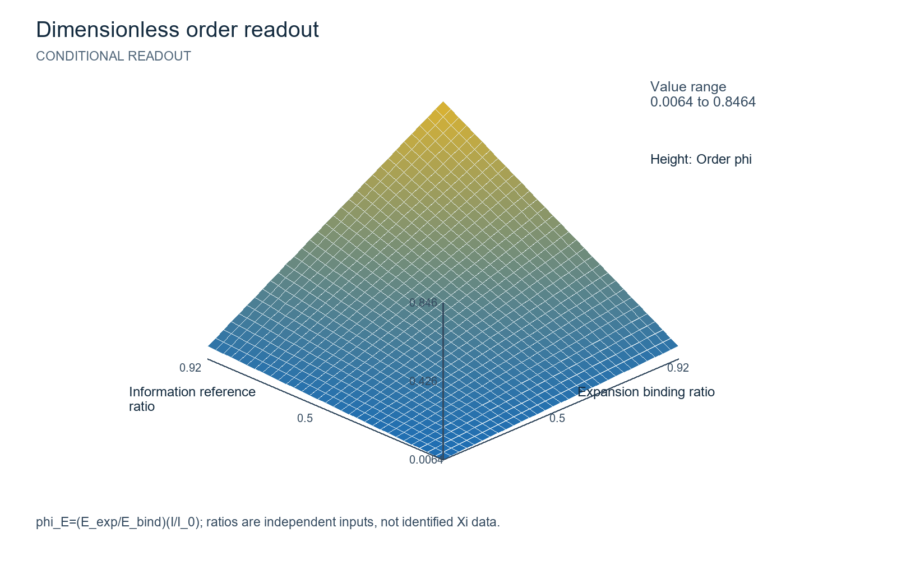

[Matching grid data](../data/figure_01.npz) · Paper section 3 · CONDITIONAL READOUT

## Figure 2

Figure 2. Positive internal geometry. Computed matrix family. Y=diag(y1,y2); G=I+Y; the positive metric is internal, not spacetime. Horizontal and vertical coordinate ranges are the sampled grids; the plotted quantity is identified on the height axis. Surface colour follows height and has no additional physical meaning.

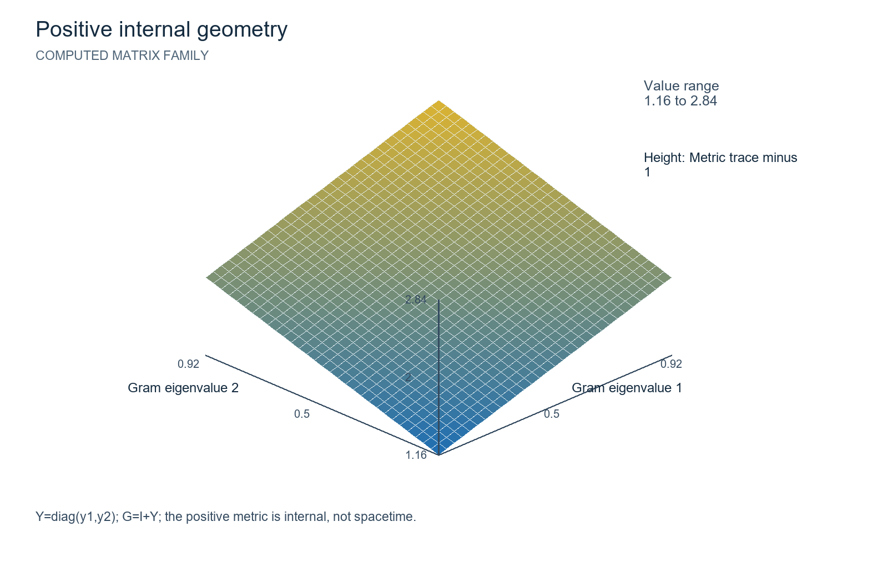

[Matching grid data](../data/figure_02.npz) · Paper section 4 · COMPUTED MATRIX FAMILY

## Figure 3

Figure 3. Spectral selection boundary. Computed projector. Q=1_[0,1)(Y); threshold 1 defines a discontinuous change of selected rank. Horizontal and vertical coordinate ranges are the sampled grids; the plotted quantity is identified on the height axis. Surface colour follows height and has no additional physical meaning.

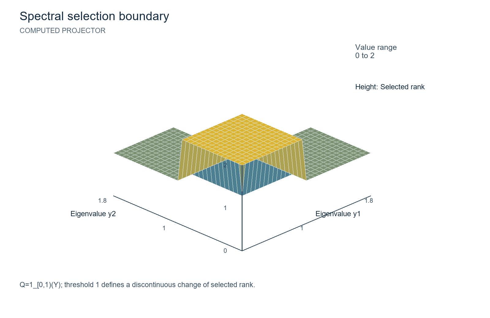

[Matching grid data](../data/figure_03.npz) · Paper section 5 · COMPUTED PROJECTOR

## Figure 4

Figure 4. Witness mass before normalization. Computed control family. Y=diag(1/2,2), P=vv^T and W=diag(p,1-p); polar selection has source P. Horizontal and vertical coordinate ranges are the sampled grids; the plotted quantity is identified on the height axis. Surface colour follows height and has no additional physical meaning.

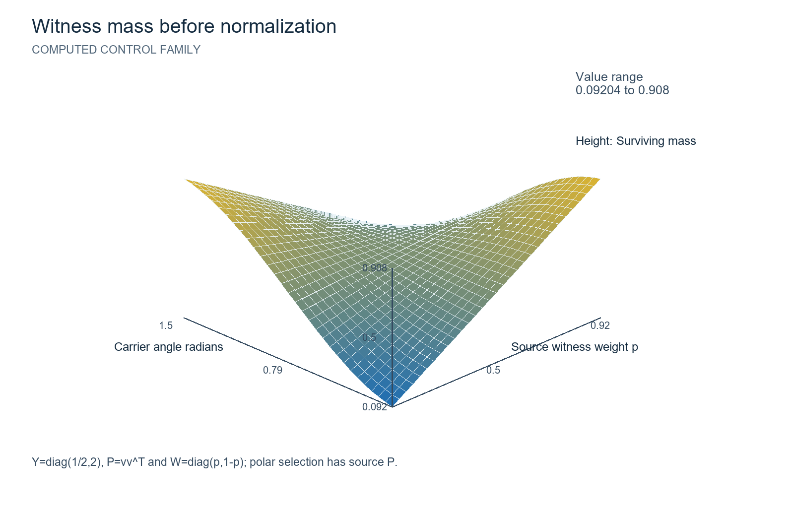

[Matching grid data](../data/figure_04.npz) · Paper section 6 · COMPUTED CONTROL FAMILY

## Figure 5

Figure 5. Endogenous formation loads. Computed ambient kernel. Y=diag(y1,0.72); P=F=W=vv^T; v=(cos theta,sin theta); formation unit E_F=1. Horizontal and vertical coordinate ranges are the sampled grids; the plotted quantity is identified on the height axis. Surface colour follows height and has no additional physical meaning.

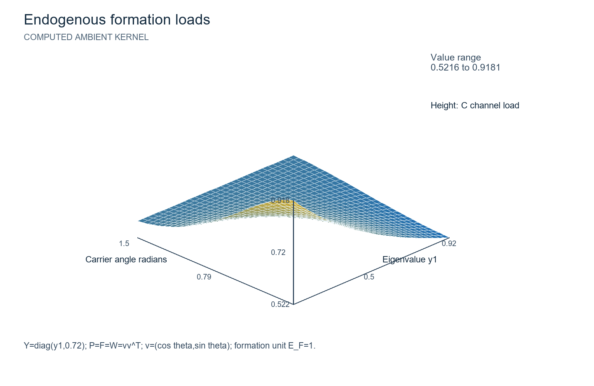

[Matching grid data](../data/figure_05.npz) · Paper section 7 · COMPUTED AMBIENT KERNEL

## Figure 6

Figure 6. Full ambient analysis. Computed ambient kernel. A:H to H direct sum H; no restriction to the selected rank-one carrier. Horizontal and vertical coordinate ranges are the sampled grids; the plotted quantity is identified on the height axis. Surface colour follows height and has no additional physical meaning.

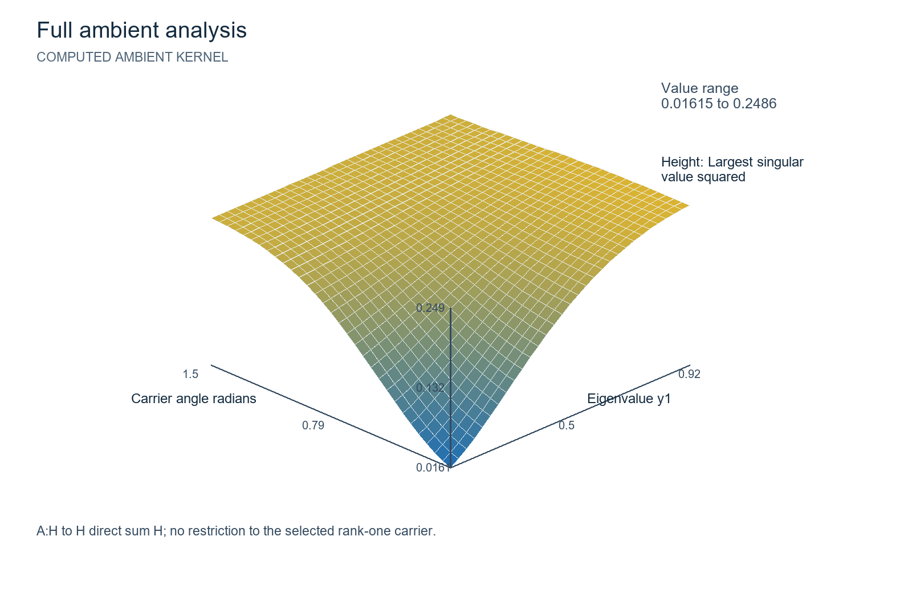

[Matching grid data](../data/figure_06.npz) · Paper section 8 · COMPUTED AMBIENT KERNEL

## Figure 7

Figure 7. Reduced singular spectrum. Computed ambient kernel. The second singular value can vanish on a rank boundary; an arbitrary full-SVD padding is excluded. Horizontal and vertical coordinate ranges are the sampled grids; the plotted quantity is identified on the height axis. Surface colour follows height and has no additional physical meaning.

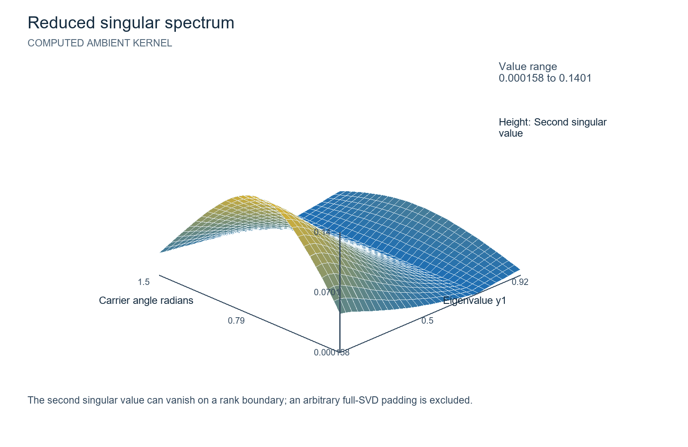

[Matching grid data](../data/figure_07.npz) · Paper section 9 · COMPUTED AMBIENT KERNEL

## Figure 8

Figure 8. Successor Gram bound. Computed ambient kernel. Y=diag(y1,y2), P=F=I; coupled global formation loads determine alpha and beta. Horizontal and vertical coordinate ranges are the sampled grids; the plotted quantity is identified on the height axis. Surface colour follows height and has no additional physical meaning.

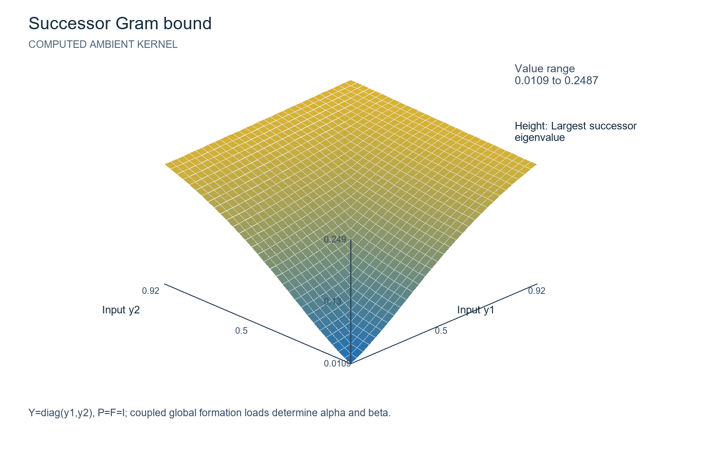

[Matching grid data](../data/figure_08.npz) · Paper section 10 · COMPUTED AMBIENT KERNEL

## Figure 9

Figure 9. R4 preserves selected witness mass. Computed ambient kernel. m4=1 to numerical precision; the exact proof uses Ran(P_sel) contained in Ran(A dagger). Horizontal and vertical coordinate ranges are the sampled grids; the plotted quantity is identified on the height axis. Surface colour follows height and has no additional physical meaning.

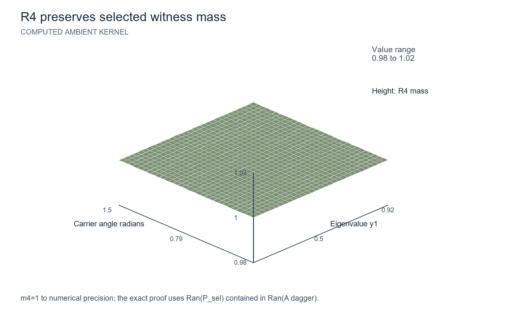

[Matching grid data](../data/figure_09.npz) · Paper section 11 · COMPUTED AMBIENT KERNEL

## Figure 10

Figure 10. Original mass and conditioned trace. Computed bookkeeping. w_next=w*m_sel; conditioned witness trace remains one and cannot encode this product. Horizontal and vertical coordinate ranges are the sampled grids; the plotted quantity is identified on the height axis. Surface colour follows height and has no additional physical meaning.

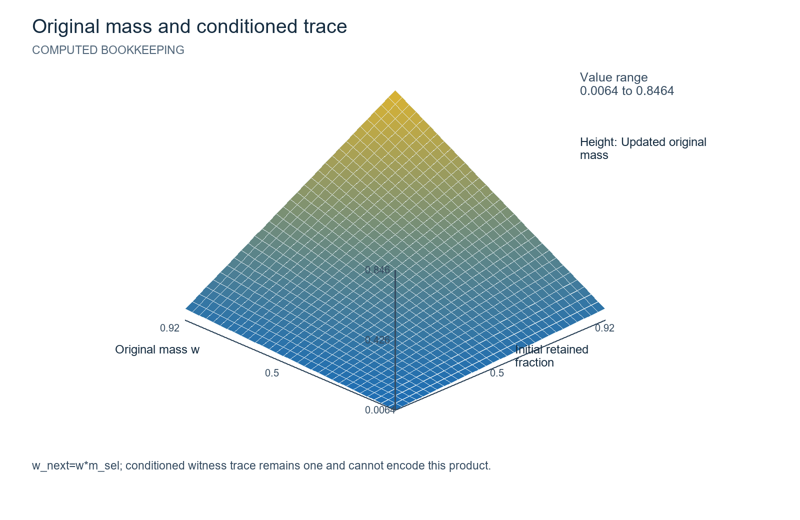

[Matching grid data](../data/figure_10.npz) · Paper section 12 · COMPUTED BOOKKEEPING

## Figure 11

Figure 11. Seed formation on a negative complement. Computed spectral control. A one-dimensional complement with lambda=-x gives seed trace kappa*x; each kappa is a separate fixed-unit model. Horizontal and vertical coordinate ranges are the sampled grids; the plotted quantity is identified on the height axis. Surface colour follows height and has no additional physical meaning.

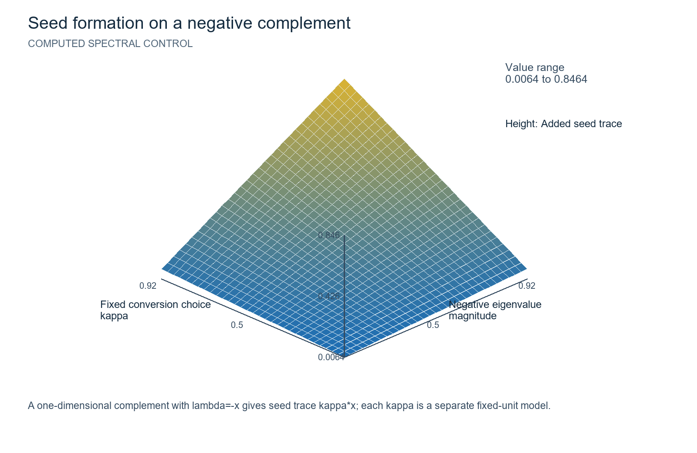

[Matching grid data](../data/figure_11.npz) · Paper section 13 · COMPUTED SPECTRAL CONTROL

## Figure 12

Figure 12. Terminal boundary of the seed rule. Computed rule. For a nonempty complement, lambda<0 and a simple minimum are required; lambda>=0 is terminal. Horizontal and vertical coordinate ranges are the sampled grids; the plotted quantity is identified on the height axis. Surface colour follows height and has no additional physical meaning.

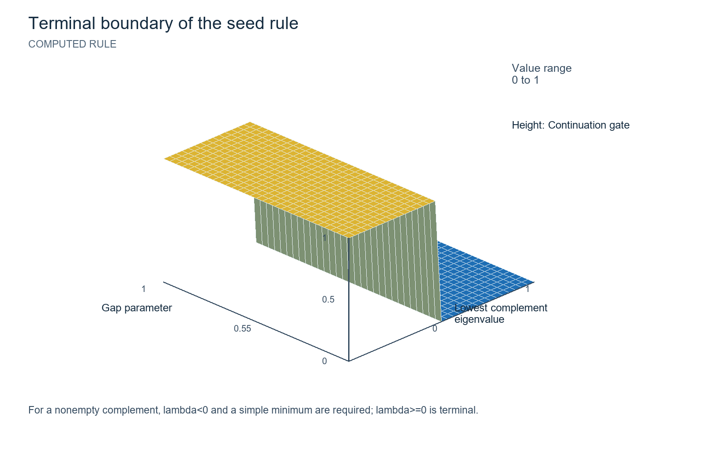

[Matching grid data](../data/figure_12.npz) · Paper section 14 · COMPUTED RULE

## Figure 13

Figure 13. Polar sensitivity bound. Computed bound. 3 times ||delta X||_2 divided by sigma_min,+; an upper bound is not an attained response. Horizontal and vertical coordinate ranges are the sampled grids; the plotted quantity is identified on the height axis. Surface colour follows height and has no additional physical meaning.

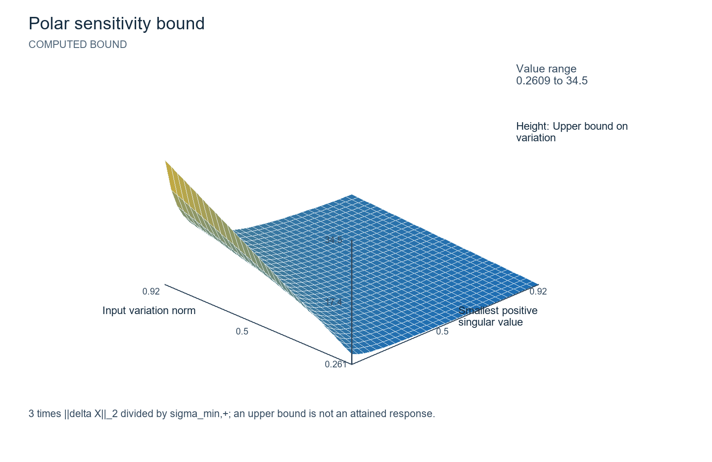

[Matching grid data](../data/figure_13.npz) · Paper section 15 · COMPUTED BOUND

## Figure 14

Figure 14. Seed eigenprojector sensitivity. Conditional perturbation scale. Illustrates inverse-gap scaling of the reduced resolvent; not a full derivative of an arbitrary kernel. Horizontal and vertical coordinate ranges are the sampled grids; the plotted quantity is identified on the height axis. Surface colour follows height and has no additional physical meaning.

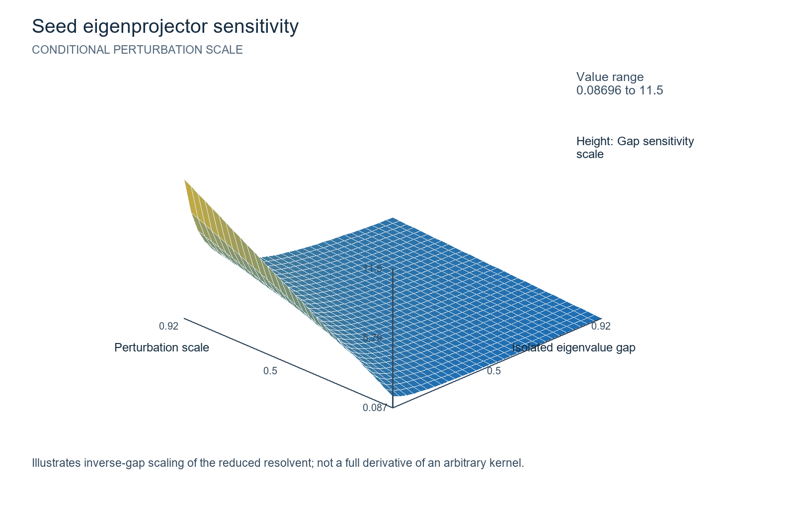

[Matching grid data](../data/figure_14.npz) · Paper section 16 · CONDITIONAL PERTURBATION SCALE

## Figure 15

Figure 15. Geometric self feedback and damping. Exact scalar kernel. P=W=1 and F>0; f(y)=2y^2/[(1+y)^2(1+y^2)]; K and F remain neutral. Horizontal and vertical coordinate ranges are the sampled grids; the plotted quantity is identified on the height axis. Surface colour follows height and has no additional physical meaning.

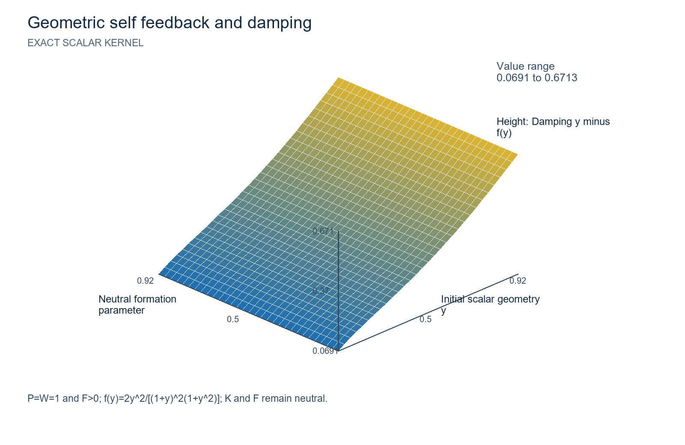

[Matching grid data](../data/figure_15.npz) · Paper section 17 · EXACT SCALAR KERNEL

## Figure 16

Figure 16. Conditional transverse Lyapunov decay. Conditional stability model. Assumes V=z^2 and V_next=(1-r)V; no such global BFG certificate is constructed here. Horizontal and vertical coordinate ranges are the sampled grids; the plotted quantity is identified on the height axis. Surface colour follows height and has no additional physical meaning.

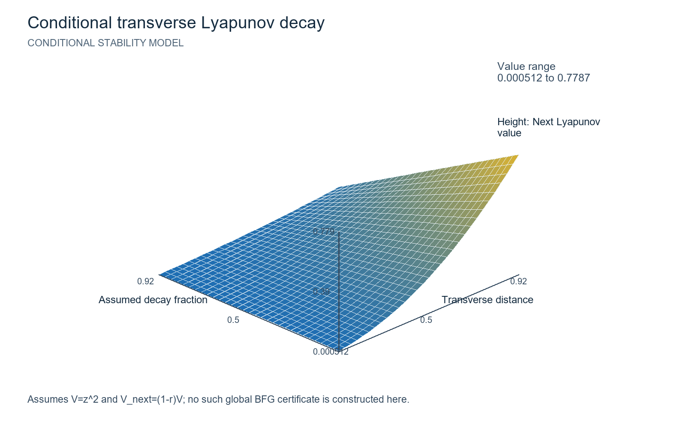

[Matching grid data](../data/figure_16.npz) · Paper section 18 · CONDITIONAL STABILITY MODEL

## Figure 17

Figure 17. Mediator amplitude and power. Computed mediator control. N_B R N_B dagger=n^2 R; amplitude mediation uses N_A=n^2, not N_A=n. Horizontal and vertical coordinate ranges are the sampled grids; the plotted quantity is identified on the height axis. Surface colour follows height and has no additional physical meaning.

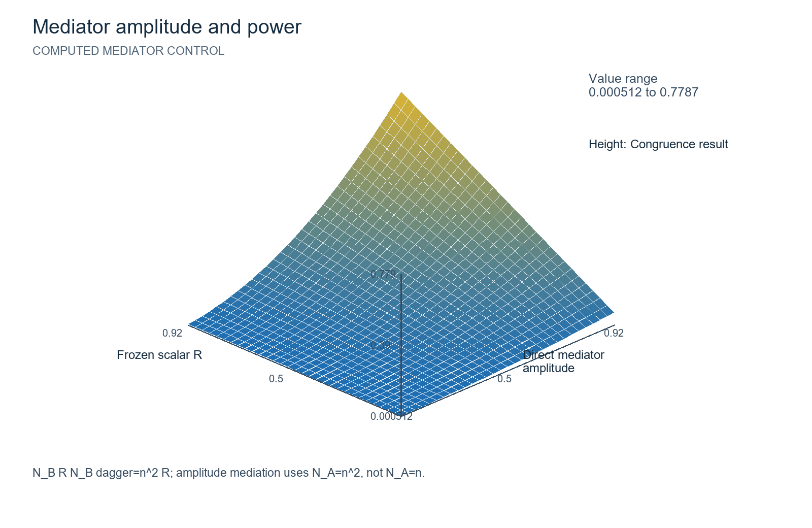

[Matching grid data](../data/figure_17.npz) · Paper section 19 · COMPUTED MEDIATOR CONTROL

## Figure 18

Figure 18. Finite horizon viability gate. Schematic constraint model. A margin diagram only; actual viability requires the unique nonterminal BFG trajectory and specified gates. Horizontal and vertical coordinate ranges are the sampled grids; the plotted quantity is identified on the height axis. Surface colour follows height and has no additional physical meaning.

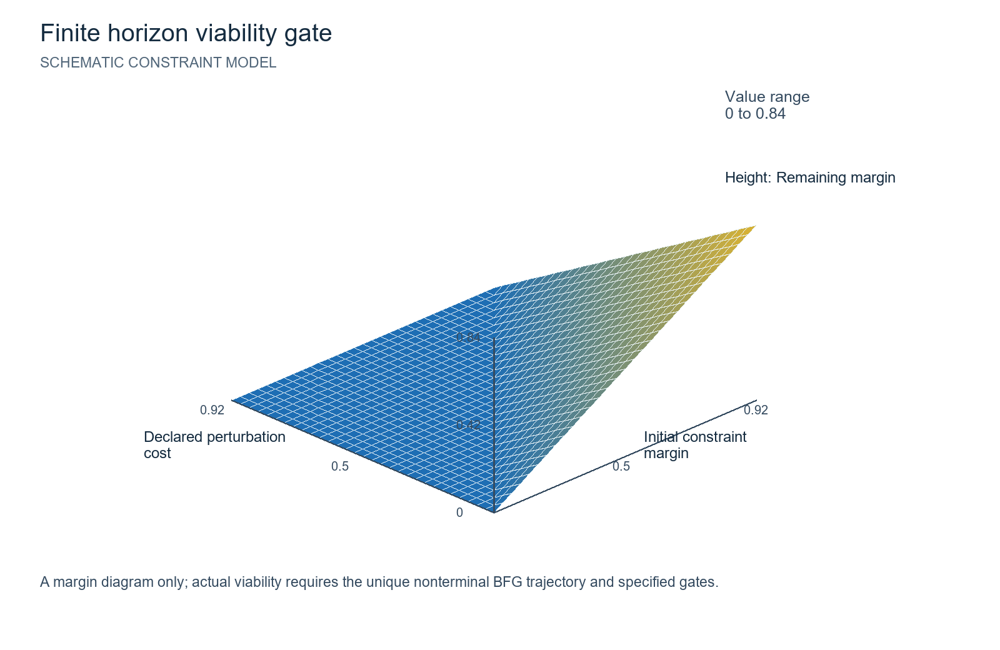

[Matching grid data](../data/figure_18.npz) · Paper section 20 · SCHEMATIC CONSTRAINT MODEL

## Figure 19

Figure 19. Scalar normal form equilibrium. Computed conditional ode. a=1.5, mu>0, b<1; this positive branch exists because a>1-b. Horizontal and vertical coordinate ranges are the sampled grids; the plotted quantity is identified on the height axis. Surface colour follows height and has no additional physical meaning.

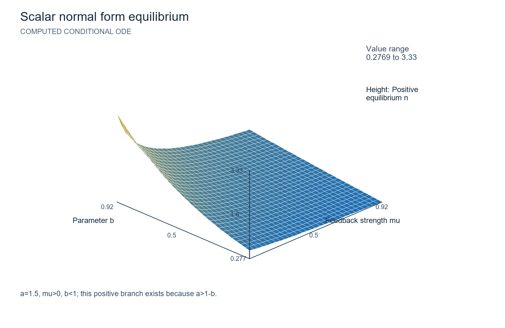

[Matching grid data](../data/figure_19.npz) · Paper section 21 · COMPUTED CONDITIONAL ODE

## Figure 20

Figure 20. A projection must close its fibers. Schematic countermodel. Projection Pi(x,h)=x with successor x+h is not closed; this is a fiber test, not a BFG bridge. Horizontal and vertical coordinate ranges are the sampled grids; the plotted quantity is identified on the height axis. Surface colour follows height and has no additional physical meaning.

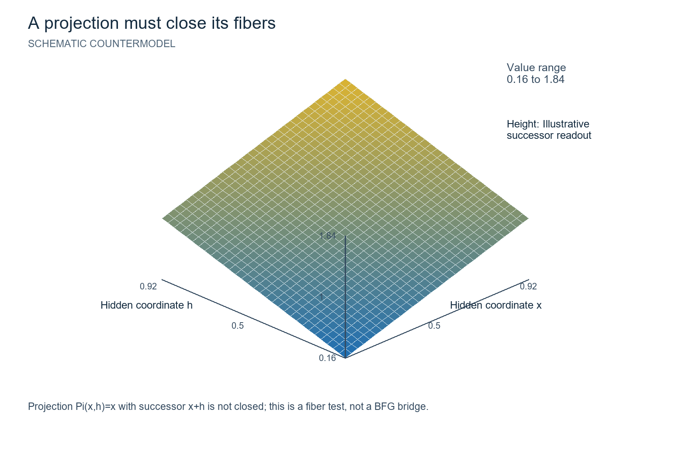

[Matching grid data](../data/figure_20.npz) · Paper section 22 · SCHEMATIC COUNTERMODEL

## Figure 21

Figure 21. Event count without calibrated seconds. Exact scalar kernel. One reclosure event is counted; no conversion to physical seconds is claimed. Horizontal and vertical coordinate ranges are the sampled grids; the plotted quantity is identified on the height axis. Surface colour follows height and has no additional physical meaning.

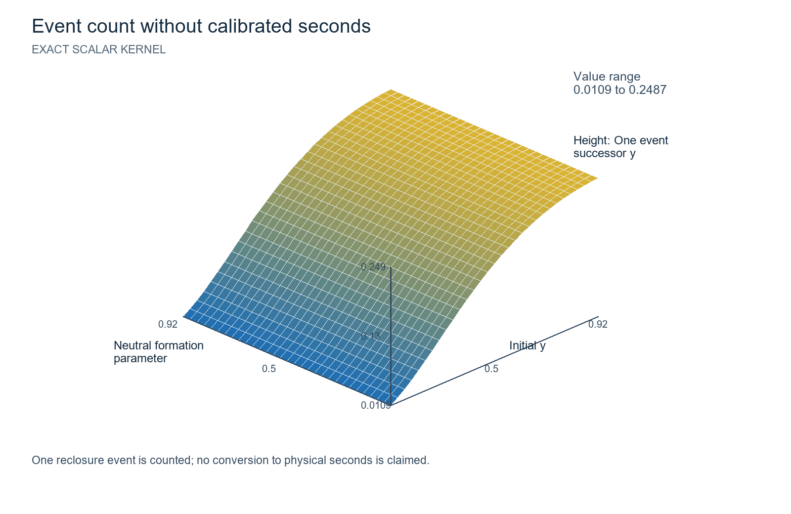

[Matching grid data](../data/figure_21.npz) · Paper section 23 · EXACT SCALAR KERNEL

## Figure 22

Figure 22. A curved geometry bridge illustration. Schematic embedding. An illustrative surface is not a Lorentz metric, gravitational field equation or prediction. Horizontal and vertical coordinate ranges are the sampled grids; the plotted quantity is identified on the height axis. Surface colour follows height and has no additional physical meaning.

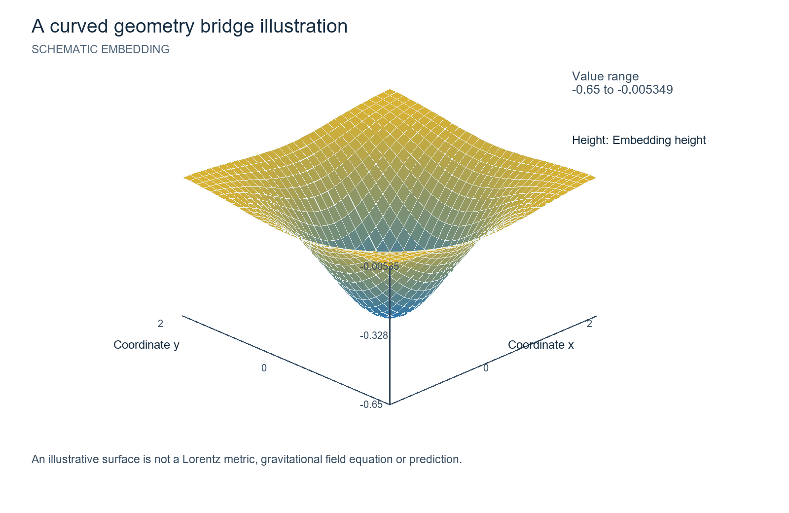

[Matching grid data](../data/figure_22.npz) · Paper section 24 · SCHEMATIC EMBEDDING

## Figure 23

Figure 23. Geometric feedback requires dynamics. Assumed potential model. V=x^2+y^2 is a pedagogical potential; stability of spacetime must follow from a specified action and bridge. Horizontal and vertical coordinate ranges are the sampled grids; the plotted quantity is identified on the height axis. Surface colour follows height and has no additional physical meaning.

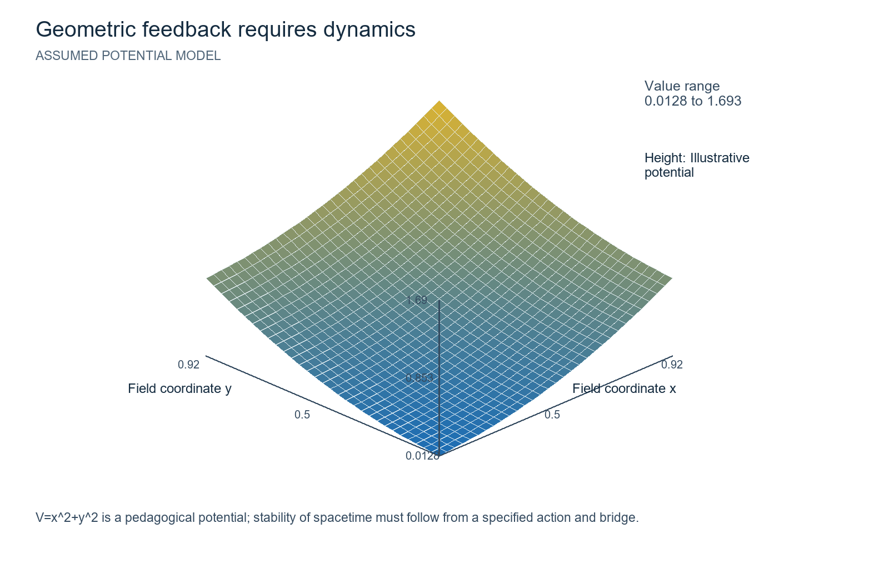

[Matching grid data](../data/figure_23.npz) · Paper section 25 · ASSUMED POTENTIAL MODEL

## Figure 24

Figure 24. Quantum state identification remains a bridge. Conditional quantum model. For a calibrated E0=|0><0|, p=tr(E0 rho); the state-identification map is additional physics. Horizontal and vertical coordinate ranges are the sampled grids; the plotted quantity is identified on the height axis. Surface colour follows height and has no additional physical meaning.

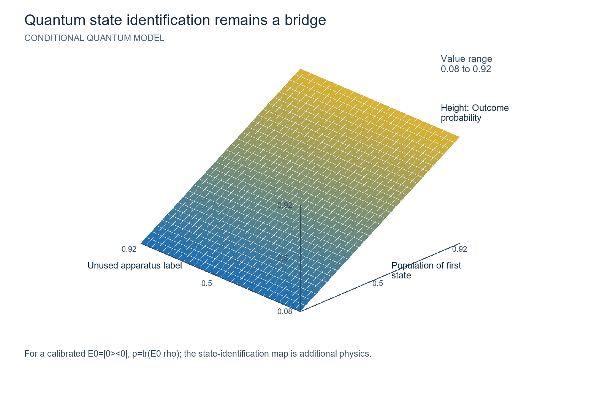

[Matching grid data](../data/figure_24.npz) · Paper section 26 · CONDITIONAL QUANTUM MODEL

## Figure 25

Figure 25. Competing quantum bridge predictions. Computed bridge comparison. At (0.75,0.25), hypotheses A and B differ by 0.5; no actual measured outcomes are used. Horizontal and vertical coordinate ranges are the sampled grids; the plotted quantity is identified on the height axis. Surface colour follows height and has no additional physical meaning.

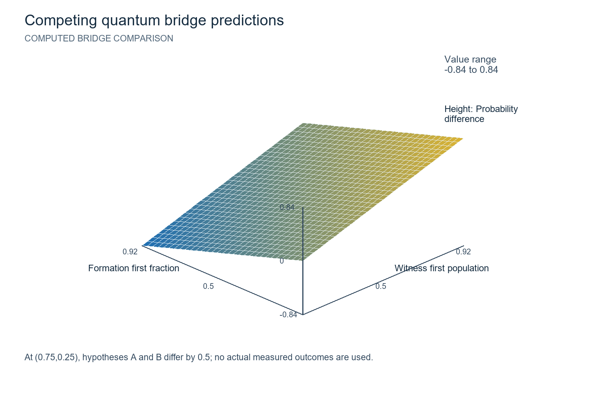

[Matching grid data](../data/figure_25.npz) · Paper section 27 · COMPUTED BRIDGE COMPARISON

## Figure 26

Figure 26. A general effect need not be projective. Computed effect test. A direct R4 effect is a projector. Generic positive effects with interior eigenvalues fail that test. Horizontal and vertical coordinate ranges are the sampled grids; the plotted quantity is identified on the height axis. Surface colour follows height and has no additional physical meaning.

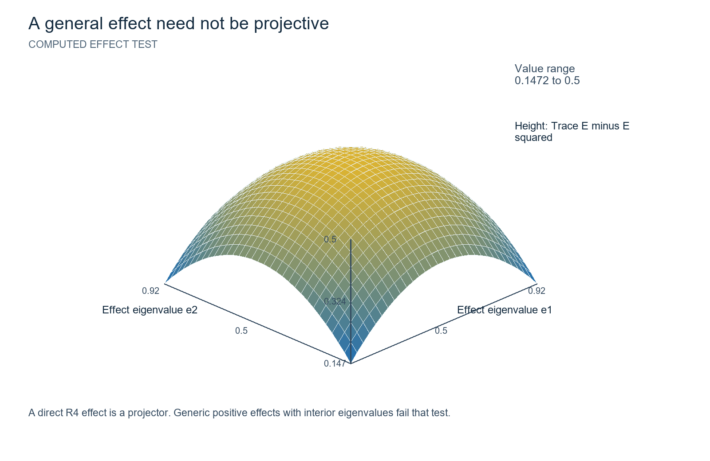

[Matching grid data](../data/figure_26.npz) · Paper section 28 · COMPUTED EFFECT TEST

## Figure 27

Figure 27. Particle hierarchy requires parameters. Schematic dependency. The surface labels a parameter dependency only; no Standard Model mass or coupling is derived. Horizontal and vertical coordinate ranges are the sampled grids; the plotted quantity is identified on the height axis. Surface colour follows height and has no additional physical meaning.

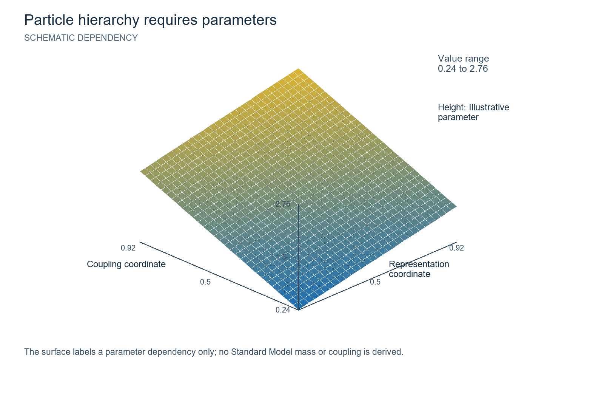

[Matching grid data](../data/figure_27.npz) · Paper section 29 · SCHEMATIC DEPENDENCY

## Figure 28

Figure 28. Atomic localization and attraction. Conventional conditional model. E(r)=1/(2r^2)-a/r; ordinary quantum scaling, not a new BFG atomic spectrum. Horizontal and vertical coordinate ranges are the sampled grids; the plotted quantity is identified on the height axis. Surface colour follows height and has no additional physical meaning.

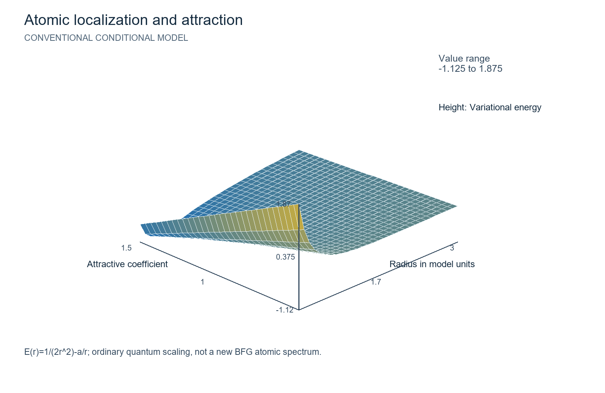

[Matching grid data](../data/figure_28.npz) · Paper section 30 · CONVENTIONAL CONDITIONAL MODEL

## Figure 29

Figure 29. Molecular binding criterion. Schematic binding landscape. The illustrative energy x^2+y^2-1 marks a negative binding region; it is not a BFG molecular potential. Horizontal and vertical coordinate ranges are the sampled grids; the plotted quantity is identified on the height axis. Surface colour follows height and has no additional physical meaning.

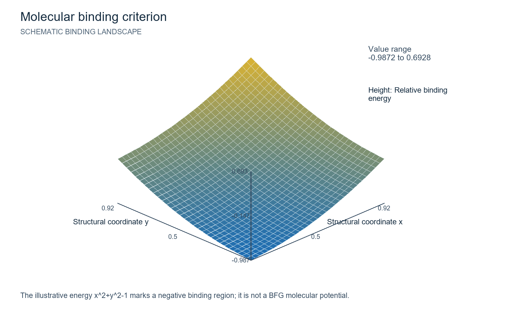

[Matching grid data](../data/figure_29.npz) · Paper section 31 · SCHEMATIC BINDING LANDSCAPE

## Figure 30

Figure 30. Biological boundary and gross flux. Computed flux identity. J_net=J_out-J_in. Stationary net flux permits nonzero gross flows; no cell viability is inferred. Horizontal and vertical coordinate ranges are the sampled grids; the plotted quantity is identified on the height axis. Surface colour follows height and has no additional physical meaning.

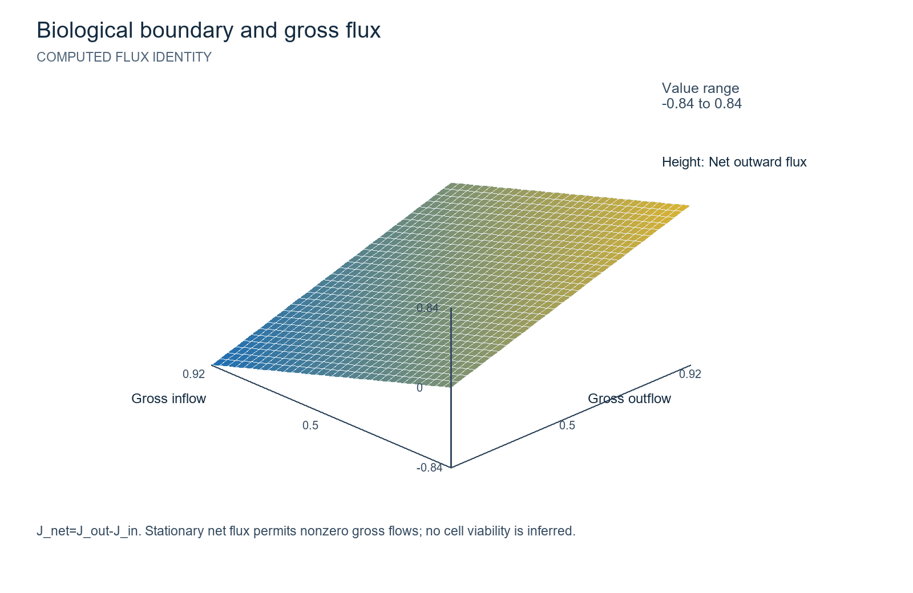

[Matching grid data](../data/figure_30.npz) · Paper section 31 · COMPUTED FLUX IDENTITY

## Figure 31

Figure 31. World and self require operational maps. Schematic functional model. A product is only a visual aid. Pi_W, Pi_S, lineage and causal closure must be independently defined. Horizontal and vertical coordinate ranges are the sampled grids; the plotted quantity is identified on the height axis. Surface colour follows height and has no additional physical meaning.

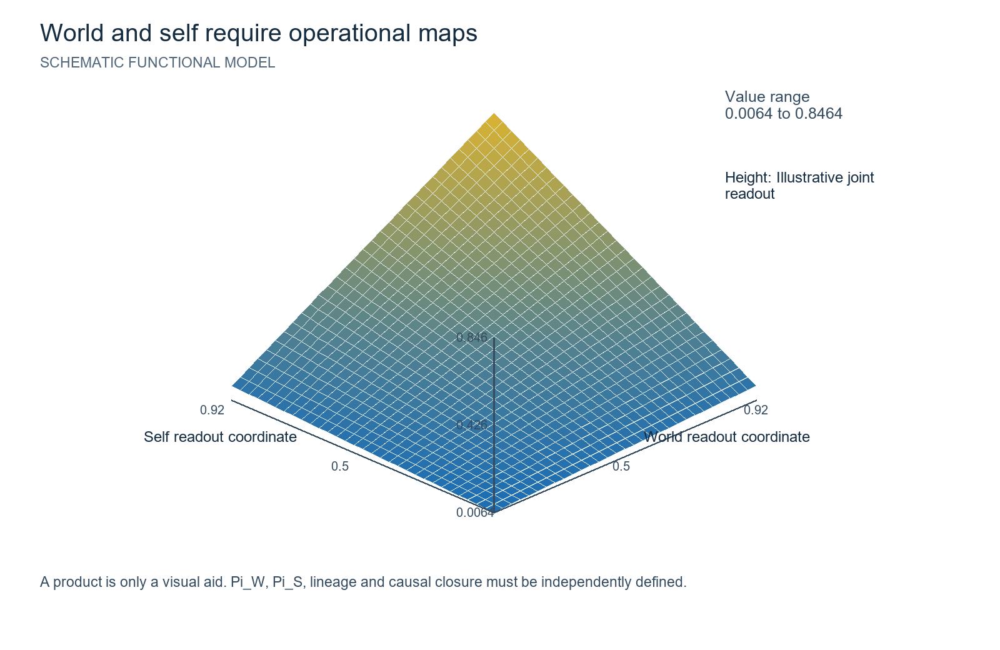

[Matching grid data](../data/figure_31.npz) · Paper section 32 · SCHEMATIC FUNCTIONAL MODEL

## Figure 32

Figure 32. Phenomenality is not a matrix consequence. Schematic status panel. The zero sheet denotes absence of a derived prediction, not absence of subjective experience. Horizontal and vertical coordinate ranges are the sampled grids; the plotted quantity is identified on the height axis. Surface colour follows height and has no additional physical meaning.

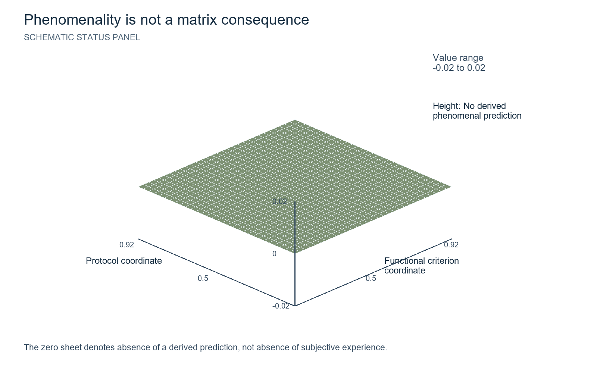

[Matching grid data](../data/figure_32.npz) · Paper section 33 · SCHEMATIC STATUS PANEL
